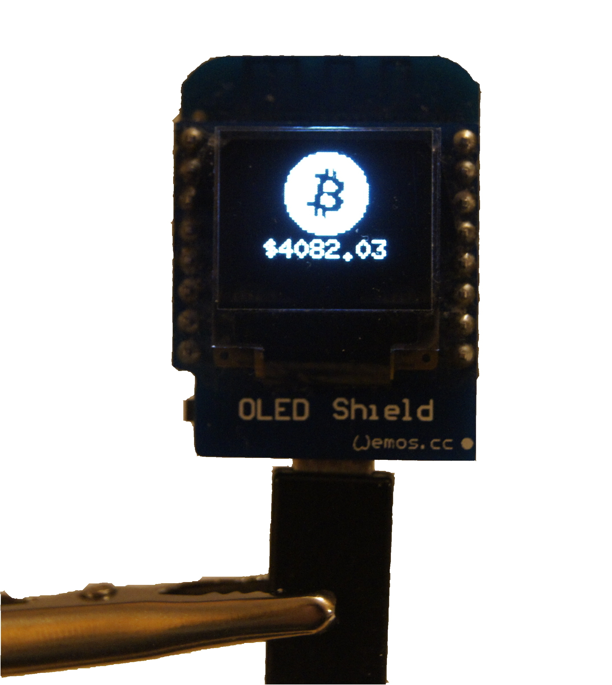

## NodeMCU CoinMarketCap price viewer thingy

A simple NodeMCU Lua script that shows prices of some cryptocurrencies and percent change over time. Uses LFS for nearly all the functions and thank to it, there is enough RAM to perform HTTPS handshake with certificate verification. For now only  BCH, BTC, ETH, LTC, XLM and XRP cryptos are shown, but other can be easily added - just change the config file and add bitmap to the `lfs-src/bitmaps.lua` file.

#### Hardware
Project uses [WeMos D1 Mini Lite](https://wiki.wemos.cc/products:d1:d1_mini_lite) ESP 8285 development board connected to [WeMos OLED Shield V1.1](https://wiki.wemos.cc/products:retired:oled_shield_v1.1.0). Whole thing is easy to make. Small but bright display should allow to see all text easily.

#### How to use it
Project uses custom-built NodeMCU 2.2.1 firmware with modules: `bit, file, gpio, http, i2c, net, node, sjson, tls, tmr, uart, u8g2, wifi`, TLS and LFS enabled and in `u8g2` settings `ssd1306_i2c_64x48` enabled as a I2C display. Other settings like fonts are default. In `config` file CoinMartketCap API key has to be set before flashing, and NodeMCU module has to be connected to WiFi and save SSID and password in memory. More information about it is avarible in [official NodeMCU Documentation](https://nodemcu.readthedocs.io/en/master/). Whole project uses `nodemcu-makefile-flash` Makefile, so after connecting the display and flashing the firmware only thing to do is `make all` and reset the device.

#### Other information: 
- License: MIT
- Author: Galion